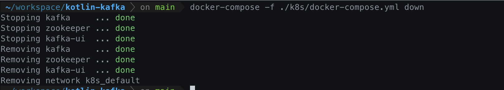
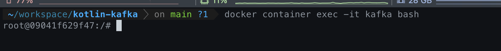

# Info

zookeeper + kafka + kafka-manager images

## 기본

### Docker Compose Up

- Docker-Compose to Start Container Command
- command use to root project

```bash
docker-compose -f ./k8k/docker-compose.yml up -d
```


### Docker Compose Down

```bash 
docker-compose -f ./k8s/docker-compose.yml down
```



## Docker Kafka

### Kafka 컨테이너 들어가기

```bash
docker container exec -it kafka bash
```



### 토픽 생성 하기

```bash
docker exec -ti kafka /opt/kafka/bin/kafka-topics.sh --bootstrap-server localhost:9092 --topic blog_test --create
```


### 토픽 리스트

```bash
docker exec -ti kafka /opt/kafka/bin/kafka-topics.sh --list --zookeeper zookeeper
```


### 토픽에 레코드 넣기

```bash
docker exec -ti kafka /opt/kafka/bin/kafka-console-producer.sh --bootstrap-server localhost:9092 --topic blog_test
```

### 토픽 레코드 확인

```bash
docker exec -ti kafka /opt/kafka/bin/kafka-console-consumer.sh --bootstrap-server localhost:9092 --topic blog_test --from-beginning
```
