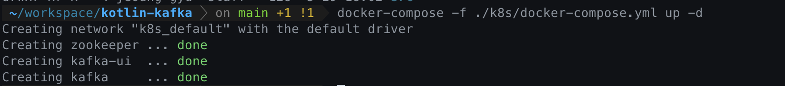
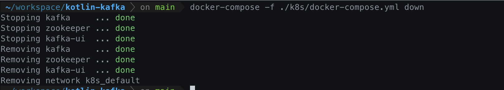

# 도커

k8s 을 통해서 kafka 컨테이너 추가

## Docker Compose Up

- Docker-Compose to Start Container Command
- command use to root project

```bash
docker-compose -f ./k8s/docker-compose.yml up -d
```



## Docker Compose Down

```bash 
docker-compose -f ./k8s/docker-compose.yml down
```



