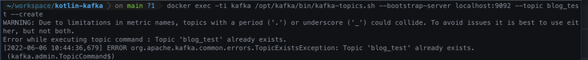
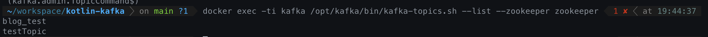

# 1. 카프카 기본 사용 방법

zookeeper + kafka + kafka-manager images

## Docker Kafka

### Kafka 컨테이너 들어가기

```bash
docker container exec -it kafka bash
```


### Compose Same Network Setting

```
docker network create kafka-network
```

### 토픽 생성 하기

```bash
docker exec -ti kafka /opt/kafka/bin/kafka-topics.sh --bootstrap-server localhost:9092 --topic blog_test --create
```



### 토픽 리스트

```bash
docker exec -ti kafka /opt/kafka/bin/kafka-topics.sh --list --zookeeper zookeeper
```



### 토픽에 레코드 넣기

```bash
docker exec -ti kafka /opt/kafka/bin/kafka-console-producer.sh --bootstrap-server localhost:9092 --topic blog_test
```

### 토픽 레코드 확인

```bash
docker exec -ti kafka /opt/kafka/bin/kafka-console-consumer.sh --bootstrap-server localhost:9092 --topic blog_test --from-beginning
```
