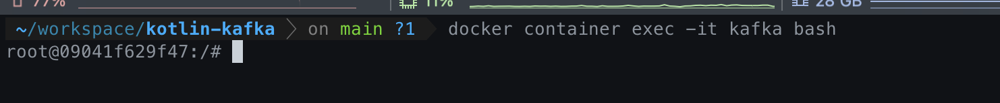
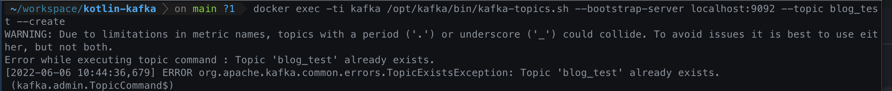
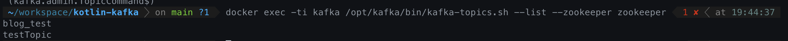
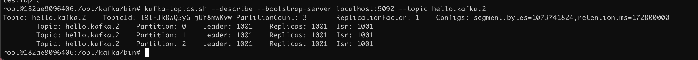

# 1. 카프카 기본 사용 방법

zookeeper + kafka + kafka-manager images

## Kafka 컨테이너 들어가기

```bash
docker container exec -it kafka bash
```



## Compose Same Network Setting

```
docker network create kafka-network
```

## 카프카 도커 컨테이너 접속

```bash
docker exec -it {id} /bin/bash
```

## 카프카 컨테이너 내에서 bash file Path

```bash
cd /opt/kafka/bin
```

## 토픽 생성 하기

### 로컬 터미널에서 사용

```bash
docker exec -ti kafka /opt/kafka/bin/kafka-topics.sh --bootstrap-server localhost:9092 --topic blog_test --create
```

### 컨테이너 내부에서 사용

```bash
kafka-topics.sh --create --bootstrap-server localhost:9092 --topic heelo_kafka
```



## 토픽 리스트

```bash
docker exec -ti kafka /opt/kafka/bin/kafka-topics.sh --list --zookeeper zookeeper
```

```bash
kafka-topics.sh --bootstrap-server localhost:9092 --list
```



## 토픽 상세 조회

```bash
kafka-topics.sh --describe --bootstrap-server localhost:9092 --topic heelo.kafka
```



## 토픽에 레코드 넣기

```bash
docker exec -ti kafka /opt/kafka/bin/kafka-console-producer.sh --bootstrap-server localhost:9092 --topic blog_test
```

## 토픽 레코드 확인

```bash
docker exec -ti kafka /opt/kafka/bin/kafka-console-consumer.sh --bootstrap-server localhost:9092 --topic blog_test --from-beginning
```

## 토픽 파티션 수정

* 토픽을 생성을 한 뒤 , 파티션을 수정을 할 수 있다.

```bash
kafka-topics.sh \
--bootstrap-server localhost:9092 \
--topic hello.kafka \
--alter \
--partitions 4
```

## 토픽 설정 변경

```bash
kafka-configs.sh \
--entity-type topics \
--entity-name hello.kafka \
--alter --add-config retention.ms=86400000 \
--bootstrap-server localhost:9092
```

## 레코드 값 넣기 (기본)

```bash
kafka-console-producer.sh \
--bootstrap-server localhost:9092 \
--topic hello.kafka
```
